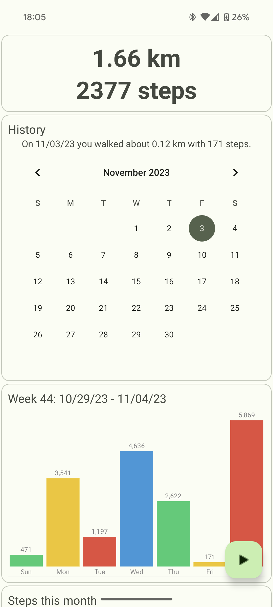
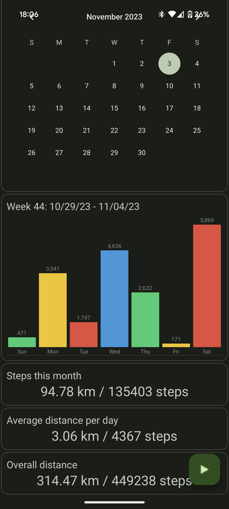

# MotionMate

MotionMate is a very simple and lightweight pedometer / step counting app for Android that counts your daily steps that can be viewed by selecting a day from the calendar view and presents the values in a nice weekly bar chart as well as some other statistics.

It uses the built-in step counter sensor, if it is present on the device and uses a fallback implementation based on the accelerometer sensor otherwise.

It requires no internet access and no special permissions.

 

## License
The project is licensed under GPLv3.

## Dependencies
-   [MPAndroidChart](https://github.com/PhilJay/MPAndroidChart) - Apache License 2.0
